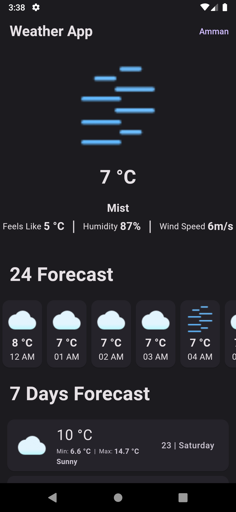
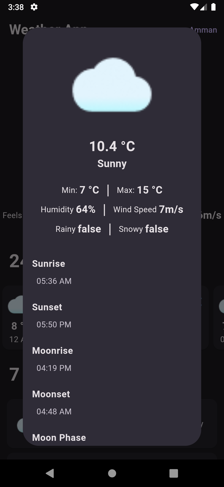

# Flutter Weather App

Welcome to our Flutter Weather App! This application provides users with accurate weather information, allowing them to stay updated on current weather conditions, forecasts, and more. With an intuitive user interface and seamless functionality, our app aims to enhance your daily life by keeping you informed about the weather no matter where you are.

## Features

- **Real-Time Weather Data**: Get up-to-date information on temperature, humidity, wind speed, and more for your current location.
- **Weather Forecast**: Plan ahead with detailed weather forecasts for the upcoming days.
- **Location-Based Forecast**: Automatically detects your location to provide personalized weather forecasts.
- **Multiple Locations**: Add and track weather conditions for multiple locations.
- **Customizable Units**: Choose between metric or imperial units based on your preference.
- **User-Friendly Interface**: Intuitive design for effortless navigation and a pleasant user experience.
- **Offline Support**: Access previously viewed weather data even when you're offline.

## Screenshots

## Dependencies

The Flutter Weather App relies on the following dependencies:

- [http](https://pub.dev/packages/http): For making HTTP requests to fetch weather data.
- [geolocator](https://pub.dev/packages/geolocator): For obtaining the device's location.
- [intl](https://pub.dev/packages/intl): For formatting dates and times.